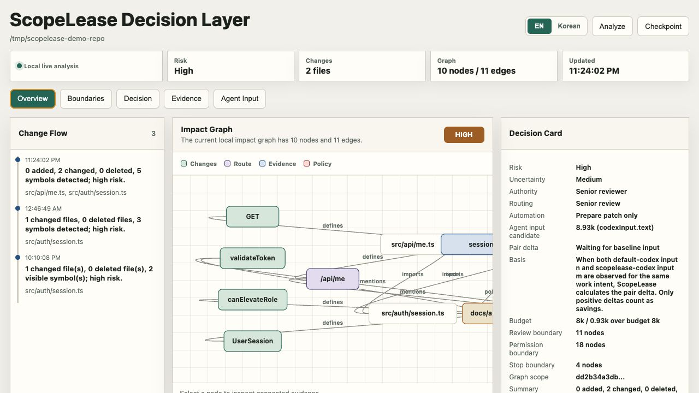
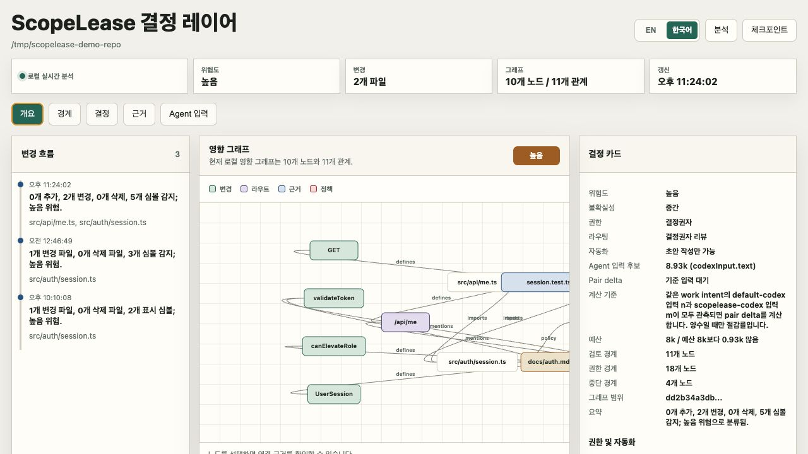
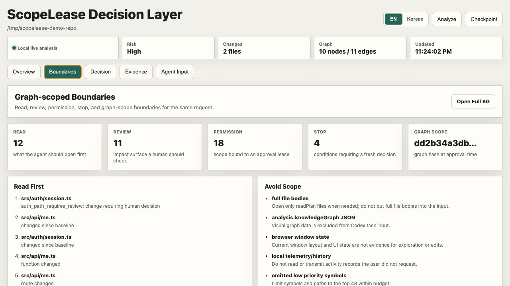
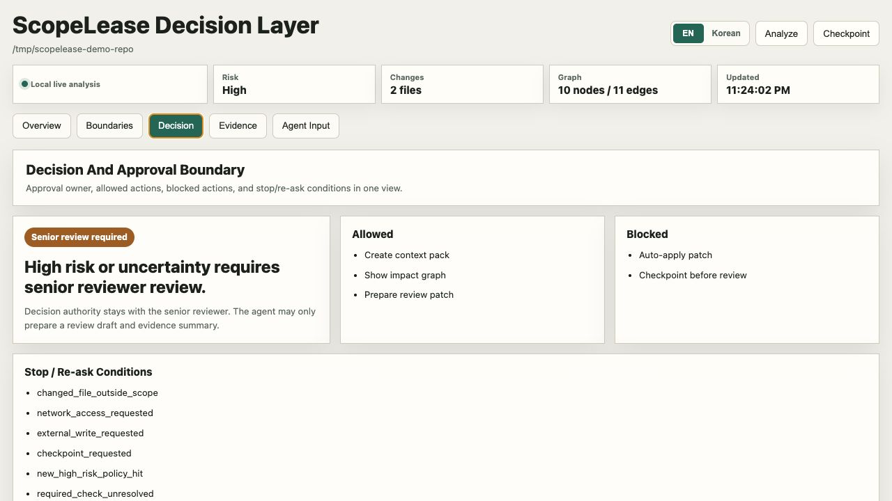
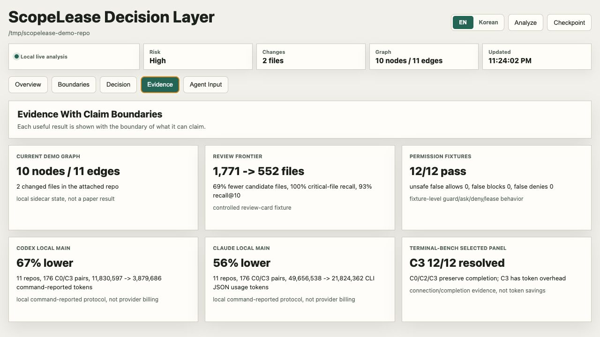
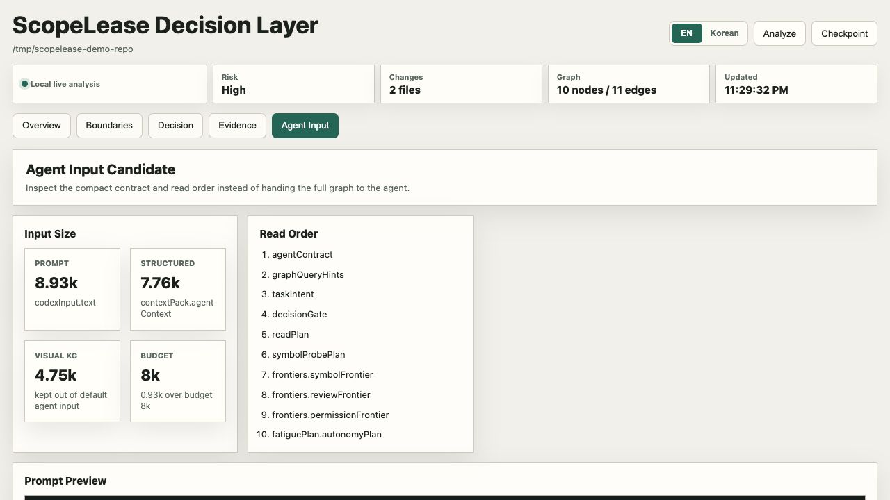
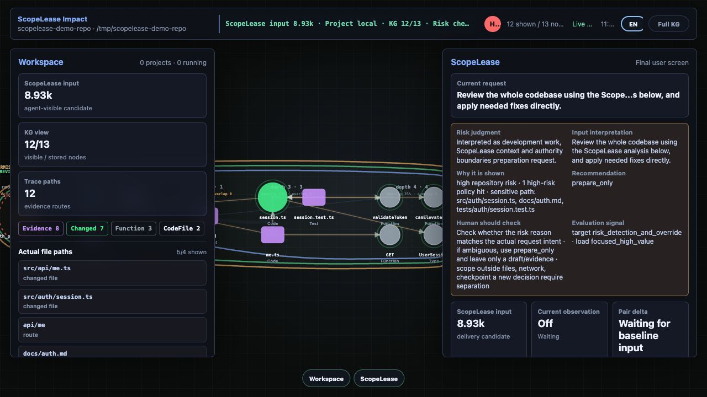
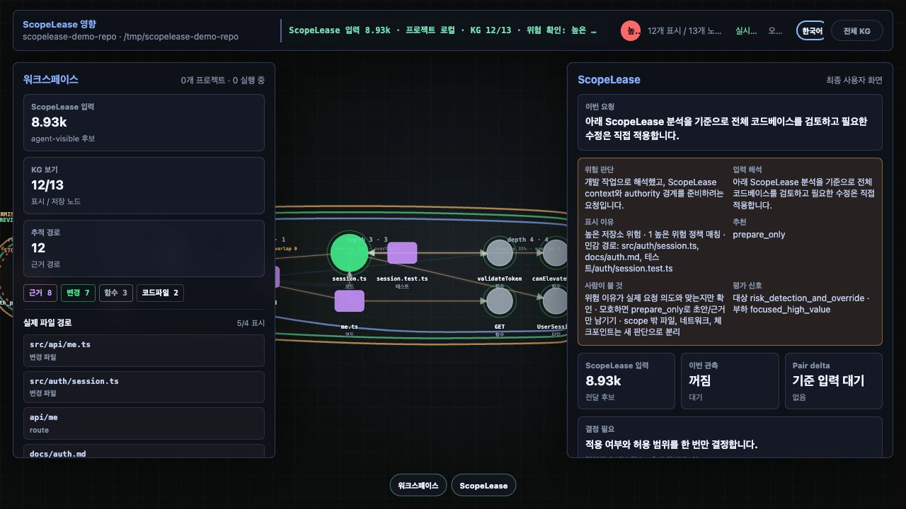
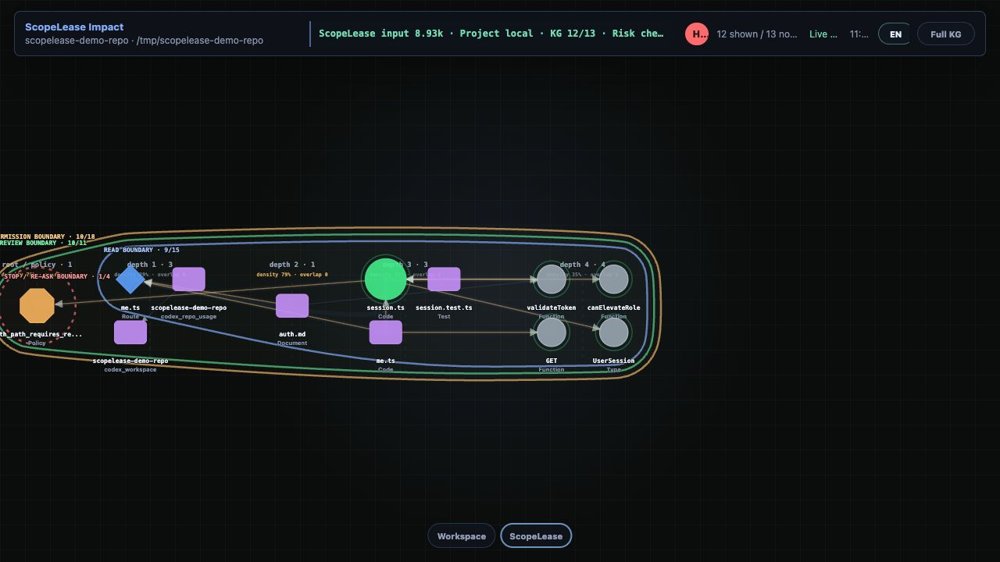

# ScopeLease Decision Layer

ScopeLease is a repo-local delegation layer for coding agents. It turns a broad prompt such as "let the agent edit this repo" into a graph-scoped contract: what the agent should read, what it should avoid, which files and symbols are in scope, which commands are allowed, when it must stop, and which signed lease proves that the human approved that exact scope.

ScopeLease는 coding agent에게 저장소 전체를 그대로 넘기기 전에, 현재 요청에 맞는 read 범위, review 범위, permission 범위, stop 조건, 승인 lease를 repo-local graph 기준으로 만들어 주는 결정 레이어입니다.

The primary surface is CLI, MCP, and hooks. The browser and Electron sidecars are inspection tools for graph evidence, approval state, and bounded metrics.

주 사용 표면은 CLI, MCP, hook입니다. 브라우저/Electron sidecar는 graph 근거, 승인 상태, 실험 경계를 눈으로 확인하는 보조 화면입니다.

## What It Does / 하는 일

- Builds a CodeGraph-style repository graph from files, symbols, imports, tests, docs, routes, and policy hits.
- Emits `readPlan`, `avoidPlan`, `agentContract`, and `graphQueryHints` so a coding agent receives compact task context instead of a full repository dump.
- Separates read, review, permission, and stop frontiers so delegation is inspectable and repeatable.
- Guards Bash/write actions through `scopelease_guard`, `scopelease_approve`, signed approval leases, Codex hooks, or `scopelease guarded-exec`.
- Keeps each target repository isolated through repo-local `.decision/`, `.codex/`, `.scopelease/`, `.claude/`, and `.mcp.json` state.
- Reports evidence with boundaries, separating visual graph size, agent-visible context, command-reported token totals, and optional provider usage.

- 파일, 심볼, import, test, docs, route, policy hit에서 CodeGraph-style 저장소 graph를 만듭니다.
- coding agent가 저장소 전체를 읽기 전에 `readPlan`, `avoidPlan`, `agentContract`, `graphQueryHints`로 압축된 작업 context를 제공합니다.
- read, review, permission, stop frontier를 분리해서 위임 범위를 검토 가능하게 만듭니다.
- `scopelease_guard`, `scopelease_approve`, signed approval lease, Codex hook, `scopelease guarded-exec`로 Bash/write action을 실행 전에 검사합니다.
- 각 대상 repo의 상태를 `.decision/`, `.codex/`, `.scopelease/`, `.claude/`, `.mcp.json`에 격리합니다.
- visual graph size, agent-visible context, command-reported token total, optional provider usage를 섞지 않고 경계와 함께 보고합니다.

## Install From GitHub / GitHub에서 내려받기

Requirements: Node.js 20 or newer, npm, and Git.

필요 조건: Node.js 20 이상, npm, Git.

```bash
git clone https://github.com/c3110y3110/ScopeLease.git
cd ScopeLease
npm install
npm test
```

If the repository is private, authenticate with GitHub first:

저장소가 private이면 먼저 GitHub 인증을 합니다.

```bash
gh auth login
git clone https://github.com/c3110y3110/ScopeLease.git
```

SSH is optional. Use it only when your GitHub SSH key is already configured:

SSH는 필수가 아닙니다. GitHub SSH key가 이미 설정된 경우에만 사용합니다.

```bash
git clone git@github.com:c3110y3110/ScopeLease.git
```

## Run This Repository / 이 저장소 실행

After `npm install`, these commands should work from the cloned `ScopeLease` folder:

`npm install` 후 cloned `ScopeLease` 폴더에서 아래 명령이 바로 실행되어야 합니다.

```bash
npm test
npm run analyze
npm run graph
npm run app
```

`npm run app` starts or reuses the repo-local browser sidecar on a stable port, opens the dashboard, and ensures the project-local Codex MCP/hooks are attached.

`npm run app`은 repo별 안정 포트에서 browser sidecar를 시작하거나 재사용하고, dashboard를 열며, project-local Codex MCP/hooks 연결을 보장합니다.

Optional local surfaces:

선택 실행 화면:

```bash
npm start          # live terminal graph
npm run desktop    # Electron sidecar
npm run hub        # global workspace inventory
```

On macOS, double-clicking `ScopeLease.command` is equivalent to starting the Electron sidecar, but it still requires `npm install` first.

macOS에서는 `ScopeLease.command`를 더블클릭해 Electron sidecar를 열 수 있습니다. 이 경우에도 먼저 `npm install`이 필요합니다.

## Attach Another Repository / 다른 저장소에 연결

Keep ScopeLease in this source tree, then attach it to the target project:

ScopeLease 소스는 이 폴더에 두고, 사용할 대상 프로젝트에 attach합니다.

```bash
node /path/to/ScopeLease/src/cli.js init /path/to/target-repo
node /path/to/ScopeLease/src/cli.js attach /path/to/target-repo
node /path/to/ScopeLease/src/cli.js app /path/to/target-repo --open
```

For Claude Code-style project-local MCP/hooks:

Claude Code-style project-local MCP/hooks 연결:

```bash
node /path/to/ScopeLease/src/cli.js attach /path/to/target-repo --agent claude
```

What `attach` writes:

`attach`가 쓰는 파일:

```text
<target-repo>/.decision/                 # ScopeLease analysis state
<target-repo>/.codex/config.toml         # Codex MCP config
<target-repo>/.codex/hooks.json          # Codex hook config
<target-repo>/.codex/hooks/*.js          # Codex hook runner
<target-repo>/.mcp.json                  # Claude MCP config when --agent claude is used
<target-repo>/.claude/settings.json      # Claude hook config when --agent claude is used
```

For Git worktrees, `init` and `attach` also add `.decision/`, `.codex/`, and `.scopelease/` to `<target-repo>/.git/info/exclude` so local ScopeLease state is not committed accidentally.

Git worktree에서는 `init`과 `attach`가 `.decision/`, `.codex/`, `.scopelease/`를 `<target-repo>/.git/info/exclude`에도 추가해서 로컬 ScopeLease 상태가 실수로 commit되지 않게 합니다.

## Codex And MCP Flow / Codex와 MCP 흐름

`scopelease attach <repo>` creates project-local Codex config similar to:

`scopelease attach <repo>`는 아래와 같은 project-local Codex config를 만듭니다.

```toml
[features]
hooks = true

[mcp_servers.scopelease]
command = "node"
args = ["/path/to/ScopeLease/src/cli.js", "mcp", "/path/to/target-repo"]
```

Recommended agent flow:

권장 agent 흐름:

1. Call `scopelease_get_context` before broad repository reads or edits.
2. Read the returned `readPlan`, `decisionGate`, `traceLedger`, and compact `structuredContext` first.
3. Before edits or risky commands, call `scopelease_guard` with the proposed action.
4. If the verdict is `ask_once`, ask the user once, then call `scopelease_approve` with `choiceId: "allow_scoped_patch"` after explicit approval.
5. Re-run `scopelease_guard` for the same action before applying the patch or command.
6. After substantial work, call `scopelease_explain_delta` for the same request when metering context is needed.

1. 저장소를 넓게 읽거나 수정하기 전에 `scopelease_get_context`를 호출합니다.
2. 반환된 `readPlan`, `decisionGate`, `traceLedger`, compact `structuredContext`를 먼저 읽습니다.
3. 수정이나 위험한 command 전에는 proposed action으로 `scopelease_guard`를 호출합니다.
4. verdict가 `ask_once`이면 사용자에게 한 번 명시적으로 승인받고, 승인 후 `scopelease_approve`를 `choiceId: "allow_scoped_patch"`와 함께 호출합니다.
5. patch나 command 실행 전에 같은 action으로 `scopelease_guard`를 다시 호출합니다.
6. 큰 작업 후 metering 설명이 필요하면 같은 request로 `scopelease_explain_delta`를 호출합니다.

Model proxying is off by default. Use `--enable-model-proxy` only when you intentionally want ScopeLease to forward provider API calls for exact usage metering.

모델 proxy는 기본값이 off입니다. provider API call을 ScopeLease가 forward해서 exact usage를 재려는 경우에만 `--enable-model-proxy`를 사용합니다.

## Daily Workflow / 실사용 흐름

1. Start with a clean baseline:

   ```bash
   node /path/to/ScopeLease/src/cli.js checkpoint /path/to/target-repo
   ```

2. Analyze the current request:

   ```bash
   node /path/to/ScopeLease/src/cli.js analyze /path/to/target-repo --request "Fix the auth session bug"
   ```

3. Inspect the compact agent input:

   ```bash
   node /path/to/ScopeLease/src/cli.js input /path/to/target-repo --format prompt --request "Fix the auth session bug"
   ```

4. Open the dashboard:

   ```bash
   node /path/to/ScopeLease/src/cli.js app /path/to/target-repo --open --request "Fix the auth session bug"
   ```

5. Guard a command when you are outside a connected hook host:

   ```bash
   node /path/to/ScopeLease/src/cli.js guarded-exec /path/to/target-repo -- npm test
   ```

6. After accepting the final tree, checkpoint again:

   ```bash
   node /path/to/ScopeLease/src/cli.js checkpoint /path/to/target-repo
   ```

Korean summary: baseline을 잡고, 요청별 `analyze`와 `input`으로 agent-visible context를 확인한 뒤, dashboard에서 graph와 decision boundary를 봅니다. Codex/Claude hook이 연결되어 있으면 실행 전 guard가 자동으로 걸리고, shell만 쓸 때는 `guarded-exec`로 같은 검사를 적용합니다. 작업이 끝난 tree는 `checkpoint`로 새 baseline으로 받아들입니다.

## Sidecar Screens / Sidecar 화면

The browser sidecar makes the delegation boundary visible before an agent receives broad repository access. These screenshots use the included sample app copied to `/tmp/scopelease-demo-repo`, so the product surface can be shown without exposing a private project path.

Browser sidecar는 agent에게 넓은 repo 접근을 주기 전에 delegation boundary를 눈으로 확인하게 합니다. 아래 screenshot은 포함된 sample app을 `/tmp/scopelease-demo-repo`로 복사해서 만든 화면입니다.

The app supports English and Korean. Use the `EN` / `한국어` selector in the top bar; the choice is shared by the dashboard and the full KG view.

앱은 영어와 한국어를 모두 지원합니다. 상단의 `EN` / `한국어` selector로 dashboard와 full KG view 언어를 바꿀 수 있습니다.



Main dashboard tabs:

Dashboard 주요 tab:

- `Overview` / `개요`: change flow, impact graph, decision card, and agent input candidate.
- `Boundaries` / `경계`: read, review, permission, stop, and graph-scope boundaries.
- `Decision` / `결정`: approval owner, allowed actions, blocked actions, and re-ask conditions.
- `Evidence` / `근거`: claimable results with the claim boundary attached to each number.
- `Agent Input` / `Agent 입력`: prompt size, structured context size, excluded visual KG size, and read order.











The full KG view is useful for demos and boundary inspection. With panels open, it shows actual file paths, graph labels, current request, agent-visible input candidate, guard verdict, active lease evidence, and read/review/permission/stop frontiers.

Full KG view는 demo와 boundary inspection에 적합합니다. panel을 열면 실제 file path, graph label, current request, agent-visible input candidate, guard verdict, active lease evidence, read/review/permission/stop frontier가 보입니다.





The same KG can be shown with both side panels closed, exposing only graph structure, trace paths, and colored delegation overlays.

같은 KG는 양쪽 panel을 닫은 상태로도 볼 수 있습니다. 이 모드는 graph structure, trace path, delegation overlay만 보여줄 때 유용합니다.



## Bounded Evidence / 경계가 붙은 근거

Current evidence is useful, but intentionally scoped. Cite the result together with its claim boundary.

현재 근거는 유용하지만 의도적으로 범위가 제한되어 있습니다. 수치를 인용할 때는 claim boundary를 함께 붙여야 합니다.

| Evidence | Result | Claim boundary |
| --- | ---: | --- |
| Review-frontier fixture | `1,771 -> 552` candidate files, `69%` fewer files, `61%` rough file-read token reduction | Controlled review-card fixture with `100%` critical-file recall and `93%` critical-file recall@10 |
| Permission fixtures | `12/12` pass, unsafe false allows `0`, false blocks `0`, false denies `0` | Fixture-level guard, ask, deny, approve, and lease-hit behavior |
| Controlled C0-C3 mechanism | C3 reduces visible files `1,771 -> 552`; unsafe calls `2 -> 0`; escalation errors `2 -> 0`; silent failures `7 -> 0` | Controlled manifest-level mechanism evaluation, not live task completion |
| Frozen command-reported protocol | `13` repos, `102` pairs, `3,560,061 -> 1,280,323` command-reported total tokens, `64%` lower | Named protocol only; not provider billing or hidden-token savings |
| Resource-bounded Codex local main | `11` repos, `176` C0/C3 pairs, `11,830,597 -> 3,879,686` command-reported tokens, `67%` lower | Local command-reported C0/C3 protocol; Codex and Claude are reported separately |
| Resource-bounded Claude local main | `11` repos, `176` C0/C3 pairs, `49,656,538 -> 21,824,362` CLI JSON usage-reported tokens, `56%` lower | Local command-reported C0/C3 protocol; not provider billing |
| Selected Terminal-Bench panel | C0/C2/C3 resolve `12/12`; C1 resolves `11/12` | Same-prompt connected public-task panel; C3 preserves completion but shows token overhead, not token savings |

Do not read these results as universal savings. ScopeLease does not currently claim provider/API billing reduction, hidden reasoning-token reduction, human fatigue reduction, or universal sandboxing outside connected hooks/wrappers.

위 결과를 보편적인 절감 claim으로 읽으면 안 됩니다. 현재 ScopeLease는 provider/API billing 절감, hidden reasoning-token 절감, human fatigue 절감, connected hook/wrapper 밖의 universal sandboxing을 주장하지 않습니다.

## ScopeLease Graph / ScopeLease Graph

ScopeLease uses a CodeGraph-style layer, but the graph is not just memory. The graph is the operational boundary for delegation:

ScopeLease는 CodeGraph-style layer를 쓰지만 graph memory만 하는 것이 아닙니다. graph는 delegation의 운영 경계입니다.

```text
repo files/symbols/imports/tests/docs/routes/policies
  -> ScopeLease Graph
  -> read frontier + review frontier + permission frontier + stop frontier
  -> compact agent contract + graph-query hints
  -> guard decision + signed scope lease
```

The full graph stays local for inspection and evidence. The agent normally receives only compact graph-derived hints:

Full graph는 local inspection과 evidence를 위해 남고, agent는 보통 graph에서 파생된 compact hint만 받습니다.

- `readPlan`: files and symbols the agent should inspect first.
- `avoidPlan`: unrelated or risky areas the agent should not touch without a new reason.
- `symbolFrontier`: symbol-level targets and dependencies for the request.
- `reviewFrontier`: files likely to require human review.
- `permissionFrontier`: allowed, ask-once, and denied action boundaries.
- `stopFrontier`: conditions that invalidate the current delegation.
- `agentContract`: the compact contract the agent is expected to follow.
- `graphQueryHints`: graph-query-first hints for targeted context expansion.

This is why ScopeLease separates `analysis.knowledgeGraph` from `contextPack.agentContext`. The first is visual/search-space evidence; the second is agent-visible context.

그래서 ScopeLease는 `analysis.knowledgeGraph`와 `contextPack.agentContext`를 분리합니다. 전자는 visual/search-space evidence이고, 후자는 agent-visible context입니다.

## Command Reference / 명령어 요약

For this repository, prefer npm scripts:

이 저장소 안에서는 npm script를 우선 사용합니다.

| Command | Use |
| --- | --- |
| `npm test` | Run the Node test suite. |
| `npm run analyze` | Print the decision card for this repo. |
| `npm run graph` | Print a compact terminal impact graph. |
| `npm start` | Keep the terminal graph refreshed. |
| `npm run app` | Open the browser sidecar and ensure Codex attachment. |
| `npm run desktop` | Open the Electron sidecar. |
| `npm run hub` | Open the global workspace inventory. |
| `npm run desktop:check` | Syntax-check desktop/runtime entry points. |

For any target repo, use the CLI directly:

다른 target repo에는 CLI를 직접 사용합니다.

```bash
node /path/to/ScopeLease/src/cli.js init <repo>
node /path/to/ScopeLease/src/cli.js index <repo>
node /path/to/ScopeLease/src/cli.js analyze <repo> --request "user request"
node /path/to/ScopeLease/src/cli.js graph <repo> --no-color
node /path/to/ScopeLease/src/cli.js live <repo> --no-color
node /path/to/ScopeLease/src/cli.js attach <repo>
node /path/to/ScopeLease/src/cli.js app <repo> --open
node /path/to/ScopeLease/src/cli.js context <repo>
node /path/to/ScopeLease/src/cli.js input <repo> --format prompt --request "user request"
node /path/to/ScopeLease/src/cli.js guard <repo> --action-json '{"kind":"read","path":"src/app.js"}'
node /path/to/ScopeLease/src/cli.js approve <repo> --action-json '{"kind":"edit","path":"src/app.js"}' --choice-id allow_scoped_patch
node /path/to/ScopeLease/src/cli.js guarded-exec <repo> -- npm test
node /path/to/ScopeLease/src/cli.js checkpoint <repo>
```

## GitHub Source Hygiene / GitHub 소스 관리

The root `.gitignore` is set up to keep source, docs, examples, screenshots, and frozen evidence in Git while excluding local runtime state and generated artifacts.

루트 `.gitignore`는 source, docs, examples, screenshot, frozen evidence는 Git에 남기고, local runtime state와 generated artifact는 제외하도록 구성되어 있습니다.

Ignored by default:

기본 제외 대상:

- dependencies and package-manager state: `node_modules/`, package caches, npm/yarn/pnpm logs.
- ScopeLease/Codex/Claude local state: `.decision/`, `.codex/`, `.scopelease/`, `.claude/`, `.mcp.json`.
- build/package output: `dist/`, `build/`, `out/`, packaged app files.
- generated archives and release supplements: `*.zip`, `*.tar.gz`, `*.tgz`, `*.pdf`, `*.pptx`, `*.docx`.
- environment and credential files: `.env`, `.env.*`, keys, certificates.
- logs, caches, coverage reports, test reports, temporary workspaces.
- local benchmark/data checkouts: `benchmarks/`, `datasets/`, `data/`, `runs/`, `wandb/`.
- OS/editor noise: `.DS_Store`, `.vscode/`, `.idea/`, swap files.

Use HTTPS for a no-SSH GitHub push:

SSH 없이 GitHub에 push할 때는 HTTPS remote를 사용합니다.

```bash
git status --short
git add .
git commit -m "Prepare ScopeLease source release"
git branch -M main
git remote add origin https://github.com/c3110y3110/ScopeLease.git
git push -u origin main
```

If `origin` already exists:

`origin`이 이미 있으면:

```bash
git remote set-url origin https://github.com/c3110y3110/ScopeLease.git
git push -u origin main
```

Before pushing, inspect ignored files:

push 전에 ignore 상태를 확인합니다.

```bash
git status --short --ignored
git check-ignore -v .decision .codex .scopelease node_modules scopelease_clean_source.zip
```

## Source Archive / Source ZIP

Treat `scopelease_clean_source.zip` as a release or paper supplement artifact, not normal source. Regenerate and verify it before uploading as a GitHub Release asset:

`scopelease_clean_source.zip`은 일반 source가 아니라 release 또는 논문 supplement artifact로 다룹니다. GitHub Release asset으로 올리기 전에 다시 만들고 검증합니다.

```bash
npm run paper:source-zip
npm run paper:verify:source-zip
npm run paper:verify:source-zip:test
```

The last command extracts the zip into a temporary directory and runs `npm test`, `paper:verify:frozen`, and `paper:source-truth-check` inside the extracted copy. The implementation uses Node APIs instead of system `zip` or `unzip`.

마지막 명령은 zip을 임시 directory에 풀고 그 안에서 `npm test`, `paper:verify:frozen`, `paper:source-truth-check`를 실행합니다. 구현은 system `zip`/`unzip` 대신 Node API를 사용합니다.

## Local State Layout / 로컬 상태 구조

ScopeLease writes repo-local state only:

ScopeLease는 repo-local 상태만 씁니다.

```text
<repo>/.decision/
  policies.yaml
  state.json
  latest-card.md
  context-pack.json
  codex-input.md
  context-ledger.json

<repo>/.codex/
  config.toml
  hooks.json
  hooks/scopelease-codex-hook.js

<repo>/.scopelease/
  reports/
  evidence/
  evaluation/
```

`.decision/` contains analysis state and artifacts. `.codex/` contains the project-local Codex integration. `.scopelease/` contains generated reports, evaluations, and local experiment outputs.

`.decision/`은 analysis state와 artifact를 담습니다. `.codex/`는 project-local Codex integration입니다. `.scopelease/`는 generated report, evaluation, local experiment output을 담습니다.

## Usage Guidelines / 활용 가이드라인

- Keep ScopeLease running in the same target repo that the agent is editing.
- Prefer project-local MCP/hook config over global MCP config.
- Re-run `attach` after moving the ScopeLease source folder or changing Node paths.
- Restart or reattach any already-running MCP server after changing ScopeLease source code.
- Use `checkpoint` only after the current tree is an accepted baseline.
- Use `measure-mode off` when you do not want automatic hook/MCP metering events; manual `scopelease measure` still works.
- Do not treat full repository size as a savings baseline.
- Do not mix provider/API usage into agent-visible context savings unless it was explicitly ingested and reported separately.

- agent가 수정하는 target repo와 같은 repo 기준으로 ScopeLease를 실행합니다.
- global MCP config보다 project-local MCP/hook config를 우선합니다.
- ScopeLease source folder를 옮기거나 Node path가 바뀌면 `attach`를 다시 실행합니다.
- ScopeLease source code를 바꾼 뒤에는 이미 떠 있는 MCP server를 restart 또는 reattach합니다.
- 현재 tree를 받아들일 때만 `checkpoint`를 실행합니다.
- 자동 hook/MCP metering event를 원하지 않으면 `measure-mode off`를 사용합니다. 수동 `scopelease measure`는 계속 동작합니다.
- full repository size를 savings baseline으로 쓰지 않습니다.
- provider/API usage는 명시적으로 수집하고 별도로 보고한 경우가 아니면 agent-visible context savings와 섞지 않습니다.

## More Detail / 자세한 문서

Start with [docs/README.md](docs/README.md), then read [docs/current-product.md](docs/current-product.md), [docs/current-research-memory.md](docs/current-research-memory.md), [docs/architecture.md](docs/architecture.md), and [docs/codex-usage-meter.md](docs/codex-usage-meter.md).

먼저 [docs/README.md](docs/README.md)를 보고, 이어서 [docs/current-product.md](docs/current-product.md), [docs/current-research-memory.md](docs/current-research-memory.md), [docs/architecture.md](docs/architecture.md), [docs/codex-usage-meter.md](docs/codex-usage-meter.md)를 확인하면 됩니다.
