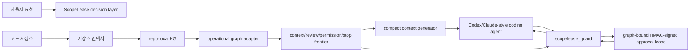
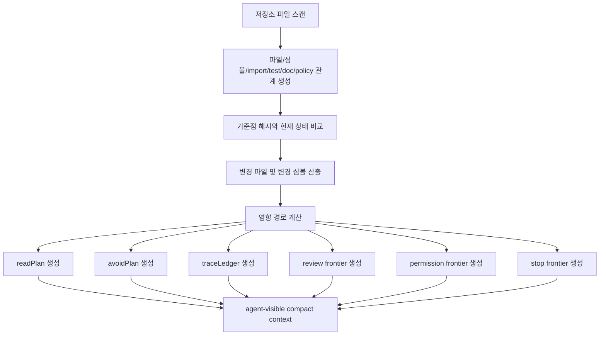
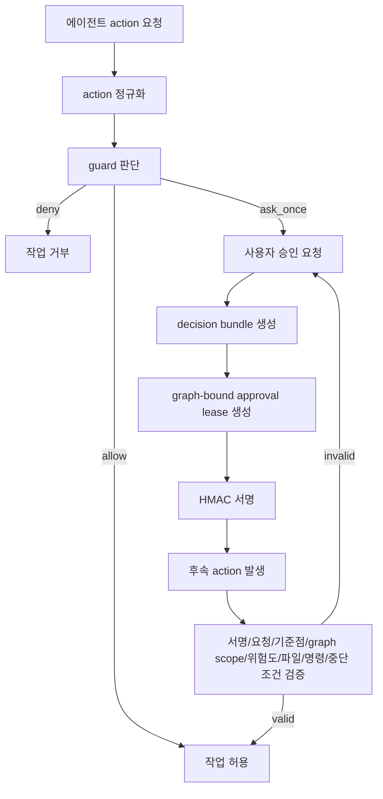
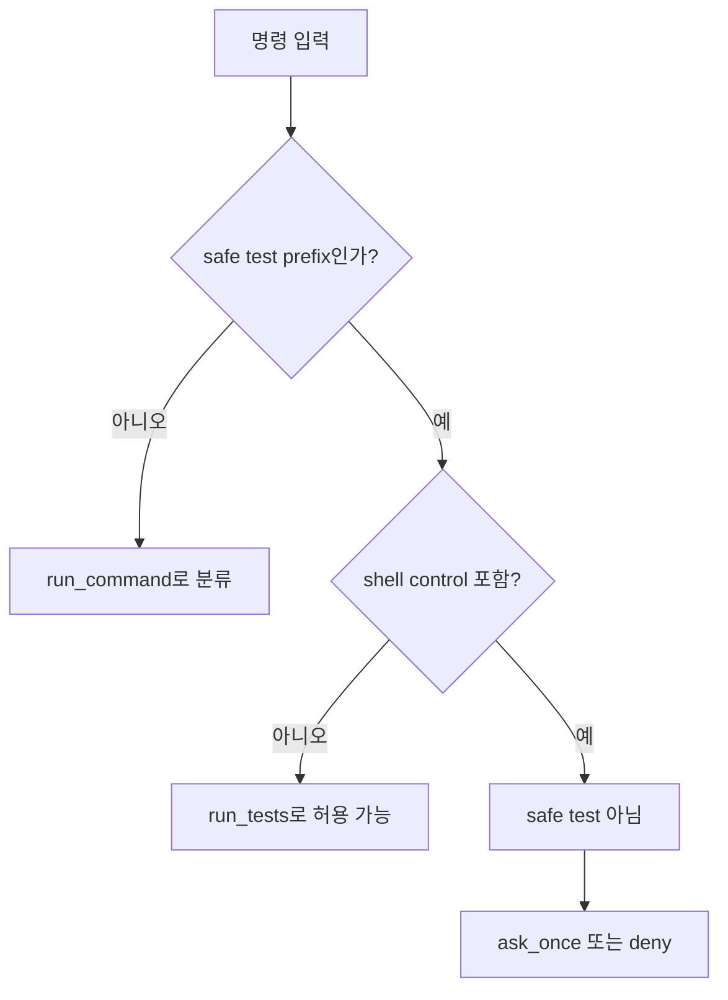
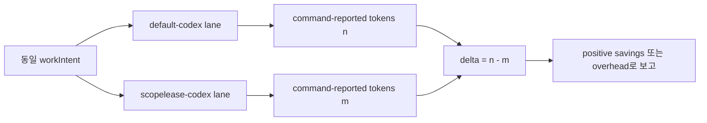
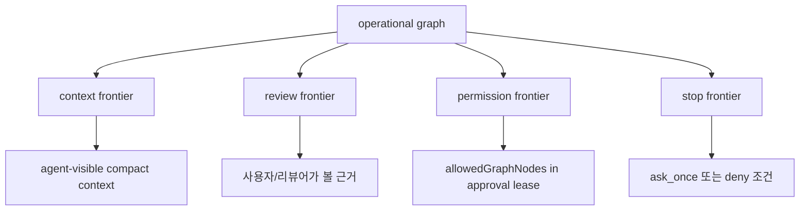

# 06. 도면 후보와 변리사 전달 체크리스트

## 도면 1. 전체 시스템 구성도

목적: ScopeLease가 저장소, 코딩 에이전트, MCP, approval lease store 사이에서 어떤 역할을 하는지 보여준다.

도면 설명 문장:

> 저장소 인덱서가 저장소 지식그래프를 생성하고, operational graph adapter가 이를 공통 graph 형태로 정규화한다. frontier generator는 context, review, permission, stop frontier를 만들고, context generator는 에이전트 입력용 compact context를 생성한다. 에이전트 action은 guard를 통해 판정되고, 사용자 승인 후 graph-bound HMAC-signed approval lease가 생성되어 후속 action 검증에 사용된다.

## 도면 2. compact context 생성 흐름도

도면 설명 문장:

> 전체 저장소 또는 전체 그래프를 agent 입력으로 제공하지 않고, 변경 집합과 관계 경로를 이용해 agent-visible compact context만 생성한다. 동시에 review frontier는 사람이 볼 검토 경계를, permission frontier는 lease로 위임 가능한 graph 경계를, stop frontier는 다시 묻거나 거부할 중단 경계를 제공한다.

## 도면 3. approval lease 생성 및 검증 흐름도

도면 설명 문장:

> approval lease는 사용자 승인 자체가 아니라, guard decision bundle과 permission frontier에 결합된 범위 제한 승인 객체이며, 후속 action마다 서명과 graph scope를 포함해 검증된다.

## 도면 4. 명령 범위 우회 방지

도면 설명 문장:

> `npm test`로 시작하더라도 `&&`, `|`, `;`, redirection 또는 command substitution이 포함되면 안전 테스트 명령으로 분류하지 않는다.

## 도면 5. paired metering 흐름도

도면 설명 문장:

> 같은 작업 의도와 pair ID를 갖는 default lane과 ScopeLease lane만 비교하고, provider billing과 command-reported token을 분리한다.

## 도면 6. graph frontier 기반 검토/권한 경계

도면 설명 문장:

> 하나의 operational graph에서 agent 입력, 사람 검토, 권한 위임, 중단 조건을 별도 frontier로 분리한다. 이 분리는 코드 그래프를 단순 시각화 도구가 아니라 context 절감, 코드 검토 축소, 권한 위임 검증에 함께 사용하는 실시예를 보여준다.

## 변리사 전달 체크리스트

전달할 파일:

- `KOREAN_PATENT_DRAFT.md`
- `patent-package/README.md`
- `patent-package/01_non_specialist_overview.md`
- `patent-package/02_examples_and_scenarios.md`
- `patent-package/03_implementation_mapping.md`
- `patent-package/04_claim_draft.md`
- `patent-package/05_evidence_and_boundaries.md`
- `patent-package/06_drawings_and_handoff.md`
- `docs/current-product.md`
- `docs/evaluation-framework.md`
- `docs/experimental-environment.md`
- `examples/evaluation/fresh-run-snapshot.schema.json`
- fresh-run output directory generated after the current implementation freeze

변리사에게 강조할 점:

1. 넓은 "AI + KG" 청구항은 약하므로 피한다.
2. 중심은 HMAC-signed approval lease와 후속 action 검증이다.
3. code graph novelty는 KG 자체가 아니라 operational graph frontier와 graph-bound approval lease 조합으로 쓴다.
4. context 절감은 readPlan-scoped workspace 및 paired metering 실시예로 넣되, 최신 평균 수치는 fresh run 이후에만 쓴다.
5. command-reported token 수치는 provider billing이 아니라고 명확히 쓴다.
6. 결정 피로는 psychological fatigue가 아니라 repeated prompt proxy로 쓴다.
7. PreToolUse/command wrapper 집행은 구현되어 있으나, host가 해당 집행 지점을 호출하는 경우로 한정해 청구항 또는 종속항에 넣는다.

## 명세서에 넣을 실시예 목록

1. 저장소 KG 생성 실시예
2. baseline diff 기반 changed file/symbol 산출 실시예
3. readPlan, avoidPlan, traceLedger 생성 실시예
4. context/review/permission/stop frontier 생성 실시예
5. graph-bound approval lease 생성 실시예
6. action 정규화 및 guard 판단 실시예
7. HMAC-signed approval lease 생성 실시예
8. lease signature mismatch 무효화 실시예
9. shell compound command 안전 테스트 오인 방지 실시예
10. approvedChangedFiles 밖 변경 시 lease 무효화 실시예
11. paired metering 실시예
12. plain-language decision summary 표시 실시예

## 다음 보강 우선순위

특허 초안만 보면 지금도 충분히 진행 가능하다. 다만 더 강하게 만들려면 다음 순서가 좋다.

1. 변리사와 독립항 1개, 종속항 10~15개로 정리
2. 위 도면 5개를 정식 도면으로 제작
3. 선행기술 대비표 작성
4. Codex/Claude no-ScopeLease vs ScopeLease-hooked fresh-run protocol을 10개 이상 저장소, 100개 이상 pair 기준으로 반복해 외적 타당성 보강
5. PreToolUse 또는 command/write wrapper 집행 계층을 도면에 표시하되, 완전한 sandbox와는 구분
6. 사람 대상 decision study를 진행해 psychological fatigue 주장을 별도 논문용으로 확장

## 최종 전달 문장

> 본 발명은 코딩 에이전트에게 단순히 저장소 지식그래프를 제공하는 것이 아니라, 저장소 지식그래프와 기준점 비교로 operational graph와 context/review/permission/stop frontier를 생성하고, 사용자 승인 범위를 graph-bound HMAC 서명 approval lease로 저장하며, 후속 에이전트 action마다 요청, 기준점, graph scope, 위험도, 파일 범위, 명령 범위, 중단 조건 및 서명을 검증하는 방법에 관한 것이다.
